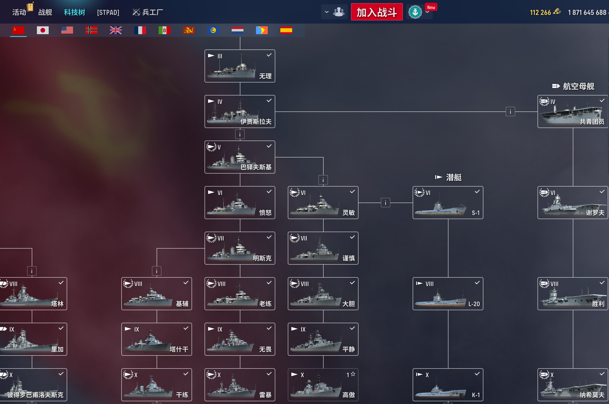
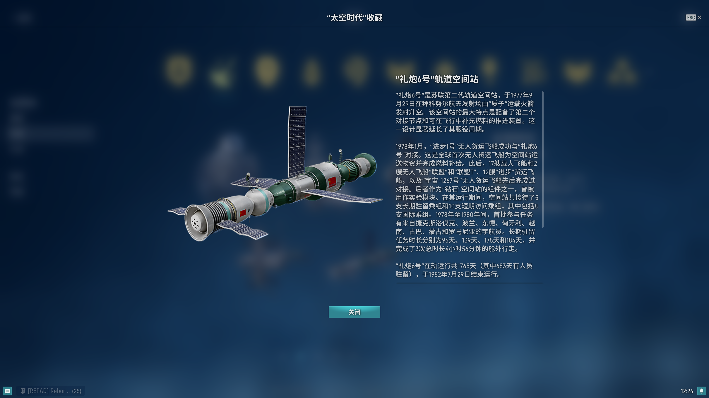

# «Мир кораблей»中文本地化（汉化）

## 现开发者名单
- [DDF_FantasyV](https://forum.korabli.su/profile/162368669-ddf_fantasyv/)
- [Kuonji_Alice_My_Waifu](https://forum.korabli.su/profile/211796407-kuonji_alice_my_waifu/)
- [M_Function](https://flot.ru/M_Function)
- [nian__gao233](https://flot.ru/nian__gao233)

> **此项目根据 *Apache License 2.0* 开源，仅用于学习交流，请勿用于非法用途。**

## 下载链接
点击下方蓝链以下载自动安装器：

**[KorabliChsModInstallerWithRuntime.exe](https://github.com/MFunction96/KorabliChsMod/releases/latest/download/KorabliChsModInstallerWithRuntime.exe)**

> 反馈渠道： 
> REPAD汉化群 791861571 
> REPAD莱斯塔交流群 980788898

## 模组简介
此本地化模组可将游戏界面的显示语言修改为简体中文。安装自动安装器即可完成一键汉化。

模组支持正式服以及PT服以下内容的汉化:
- 港口、战斗、作战任务界面
- 科技树及舰船描述
- 收藏品及介绍
- 活动特殊界面 
- 游戏内聊天
- 其他游戏文本词条

## 模组特点
- 风格一致的游戏术语

> 同时游玩Lesta和WG服务器，对于同一个功能称呼千奇百怪？

我们参考战舰世界新加坡组的简体中文本地化，并对于其中存在的错译、漏译以及音译等问题进行修正，使得游戏文本的风格一致。

- 严格的舰名与历史考据

> 音译？虚构？我们拒绝。

对于舰名，我们力求遵循命名规律，有意译意，无意译音；对于历史描述，我们参照相关历史文献进行审查和考据；对于专业名词，我们采用官方或国际通用译名。

- 流畅自然的文字表述

>还在为生硬晦涩的机翻文本苦恼？

我们的翻译人员要求精通中文、英文，熟练掌握俄语，确保游戏文本流畅且准确。

- 及时的更新推送

>无法及时安装，PT新体验慢人一步？

我们通常在正式服和PT服前推送更新，确保玩家能够第一时间体验新功能。

- 良好的社区支持

我们的开发人员同时致力于«Мир кораблей»的社区开发环境，积极为中文本地化提供支持。

## 效果展示
安装此模组后的效果如下：
- 港口界面

- 战斗界面

- 科技树界面

- 聊天界面

- 舰船描述

- 收藏品描述

## 功能

自动安装器支持以下功能：
- [x] 安装正式服汉化
- [x] 安装测试（PT）服汉化
- [x] 自动识别游戏目录
- [x] 自动更新
- [ ] 国内镜像源

## 友情链接
- [猫叔UoCat](https://space.bilibili.com/10604786)
- [浩舰](https://iwarship.net/)
- [«Мир кораблей»](https://korabli.su/)及[论坛](https://forum.korabli.su/)

## 常见问题
>在提出任何问题之前，请确保已经阅读过了[提问的智慧](https://github.com/ryanhanwu/How-To-Ask-Questions-The-Smart-Way/blob/main/README-zh_CN.md)。

Q.为什么安装了汉化包，游戏还是没有变化？ 
A.检查以下内容是否正确：`安装目录`、`游戏及汉化版本`。 
**兵工厂、问卷调查等游戏内置浏览器内容仍将以俄语显示。** 
**同时，如游戏已经预载更新，请将汉化安装在数字第二大的文件夹中。** 
如以上措施无效，请在issue或qq群内反馈。
***
Q.为什么安装了汉化包，游戏内还会出现乱码？ 
A.检查以下内容是否正确：`安装目录`、`游戏及汉化版本`、`模组冲突`。 
如以上措施无效，请在issue或qq群内反馈。
***
Q.杀毒软件提示有病毒，我应该怎么办？ 
A.杀毒软件误报，选择`信任程序`或者`保留`等选项继续安装。
***
Q.我使用安装器时出现了问题，应该怎么办？ 
A.安装器相关问题请在KorabliChsMod的[issue](https://github.com/MFunction96/KorabliChsMod/issues)下进行反馈.

